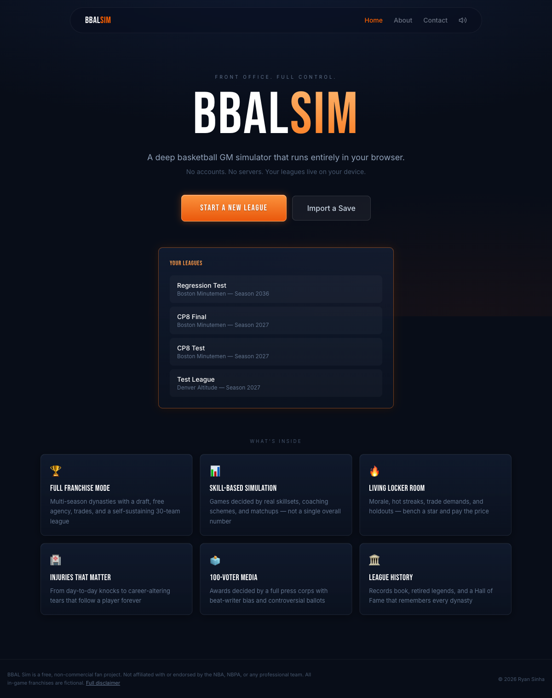
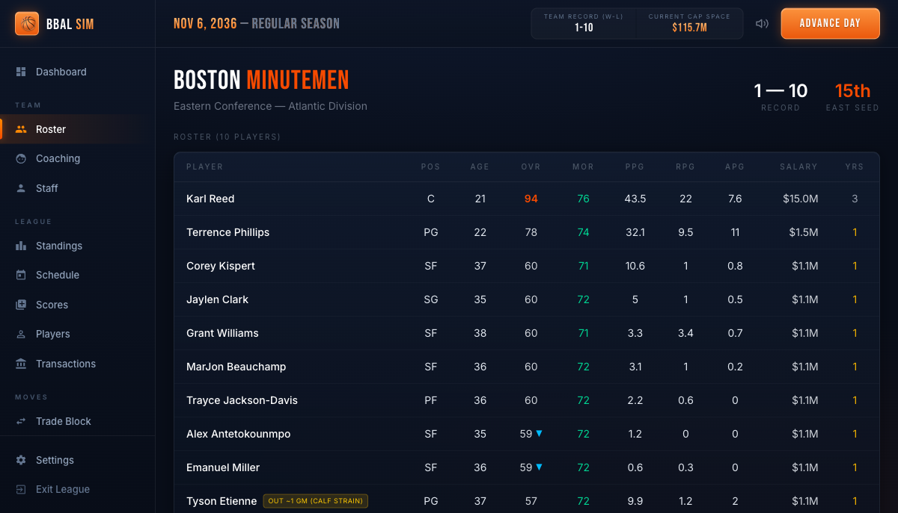
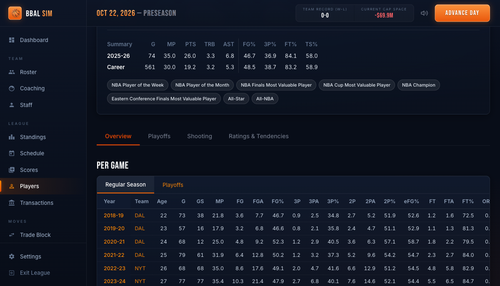

# 🏀 BBAL Sim — Basketball GM Simulator

A deep basketball general-manager simulator that runs entirely in the browser.
Take over a franchise, build through the draft or trade for stars, manage egos
and injuries, and chase championships across as many seasons as you can stomach.

**No accounts. No servers.** Every league lives in your browser (IndexedDB) and
can be exported/imported as a file.



## Features

- **Full franchise mode** — 30 fictional teams, 82-game schedule, play-in
  tournament, best-of-seven playoffs, weighted draft lottery, free agency,
  and a self-sustaining CPU league that never breaks across seasons
- **Skill-based simulation** — game outcomes come from individual skillsets,
  coaching schemes, player tendencies, and matchups; the overall rating is
  cosmetic and never drives the sim
- **A living locker room** — morale reacts to winning, losing, and playing
  time; unhappy stars demand trades, go public, and eventually hold out
- **Injuries that matter** — from day-to-day knocks to career-altering tears
  with permanent rating loss, shaped by durability profiles and team trainers
- **100-voter media** — awards decided by a full press corps with beat-writer
  bias, narratives, controversial ballots, and full transparency
- **Contract gameplay** — extension deadline negotiations, player options,
  and CPU front offices that lock up their own stars
- **Coaching control** — rotations and minutes, offensive/defensive schemes,
  pace, 3PT emphasis, and injury philosophy
- **League history** — records book, awards archive, retired players, and a
  Hall of Fame that remembers every dynasty

| Roster management | Player pages |
|---|---|
|  |  |

## Tech

React 19 · TypeScript · Tailwind CSS v4 · Dexie.js (IndexedDB) · Vite

The entire simulation — game engine, trade AI, media voting, injury system —
runs client-side.

## Run locally

```bash
cd frontend
npm install
npm run dev
```

## Deploy

The app is a static SPA. `frontend/vercel.json` and
`frontend/public/_redirects` handle client-side routing on Vercel and
Netlify respectively.

```bash
cd frontend
npm run build   # outputs to frontend/dist
```

## Legal

BBAL Sim is an unofficial, non-commercial fan project for educational and
portfolio purposes. It is not affiliated with or endorsed by the NBA, NBPA,
or any professional team. All in-game franchises are fictional; player names
and public statistics are used consistent with C.B.C. Distribution v. MLB
Advanced Media (8th Cir. 2007) and Daniels v. FanDuel (Ind. 2018). No player
photographs or likenesses are displayed. Contact: ryan@ryansinha.dev

---

Built by [Ryan Sinha](https://ryansinha.dev)
